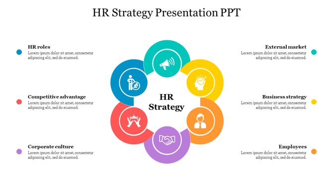

# HR-Attrition

___

## Introduction
This is a Power BI project on HR analysis of employers called **HR Attrition**. The project is to analyze, draw insights and answer crucial questions and help the HR department make adequate data driven decisions. 

_**Disclaimer**_: _All datasets and reports do not represent any company, institution or country but just a dummy dataset to demonstrate capability of Power BI_

## Problem Statement 
1.	What is the total attrition of education field and age
2.	What is the total attrition by job role 
3.	What is the monthly income and attrition by job role 
4.	The effect of environment in the employee wellness 

## Skill/concept demonstrated 
The following Power BI features were incorporated.

Bookmarking, DAX, Quick measures, Page navigation, Grouping, Filters, etc. 

## Visualization 
The report comprises of four pages 
1. Demography
2. Turnover analysis 1
3. Turnover analysis 2
4. Employee wellness

___
### 1. Demography
   

Features:
- Percentage of male and female employees
- Age range of employees
- Marital status demograpgy

___
### 2. Turnover Analysis 1
   

Features:
- Total attrition by business travel
- Total attrition by job role 
- Total attrition by years in current role

___
### 3. Turnover Analysis 2
   

Features:
- Monthly income and attrition by job role
- Performance rating
- Total attrition by overtime

___
### 4. Employee wellness
   

Features:
- Job relationship satisfaction
- Total attrition by environment satisfaction
- Total attrition by job role
- Total attrition by job satisfaction

### Conclusion
1. High Attrition Linked to Job Satisfaction: Employees who are “Satisfied” with their jobs surprisingly have the highest attrition (73), which might suggest underlying issues not captured by satisfaction ratings alone.
2. Poor Environment Satisfaction Drives Attrition: “Very dissatisfied” employees with their environment show the highest attrition (72), followed closely by “Satisfied” and “Very satisfied” ones, indicating potential discrepancies between stated satisfaction and actual experiences.
3. Moderate Job Involvement Has Highest Attrition: The majority of attrition (125) comes from employees with “Moderate” job involvement, possibly reflecting disengagement or misalignment with job roles.
4. Low Performance Ratings Correlate with High Attrition: Employees with low performance ratings (200) show significantly higher attrition than those rated high (37), emphasizing a strong link between performance and turnover.
5. Work-life Balance Issues Are Evident: Most attrition is from employees who rate their work-life as “Average” (127) and “Good” (58), suggesting room for improvement even among those with seemingly acceptable work-life conditions.
6. Relationship Satisfaction Impacts Retention: Those “Satisfied” and “Very Satisfied” in relationships with managers or colleagues still account for substantial attrition (71 and 64 respectively), indicating relational dynamics may need deeper evaluation.

### Recommendation
1. Investigate Underlying Causes of Attrition Among ‘Satisfied’ Employees:
   - Conduct qualitative surveys or exit interviews to explore why employees who report satisfaction still leave the company.

2. Enhance the Physical and Psychological Work Environment:
   - Improve office ergonomics, reduce noise, provide wellness programs, and address reported issues in environment satisfaction.

3. Develop Targeted Engagement Programs:
   - Focus on employees with “Moderate” involvement by offering growth opportunities, role clarity, and recognition programs to deepen engagement.

4. Address Performance Issues Through Training and Support:
   - Implement mentorship and development programs for low-performing employees rather than letting them attrite without intervention.

5. Reassess Work-Life Balance Policies:
   - Introduce flexible schedules, remote work options, and workload management to reduce stress and enhance overall balance.

6. Review Management and Team Relationship Practices:
   - Train managers on emotional intelligence, feedback delivery, and relationship-building to improve team cohesion and employee satisfaction.

7. Implement Predictive Analytics for Early Attrition Detection:
   - Use data models to flag high-risk employees based on their satisfaction, performance, and involvement scores for early intervention.

8. Increase Transparency and Communication Across All Levels:
   - Encourage open dialogue about job expectations, career paths, and organizational changes to build trust and reduce uncertainty-driven exits.

