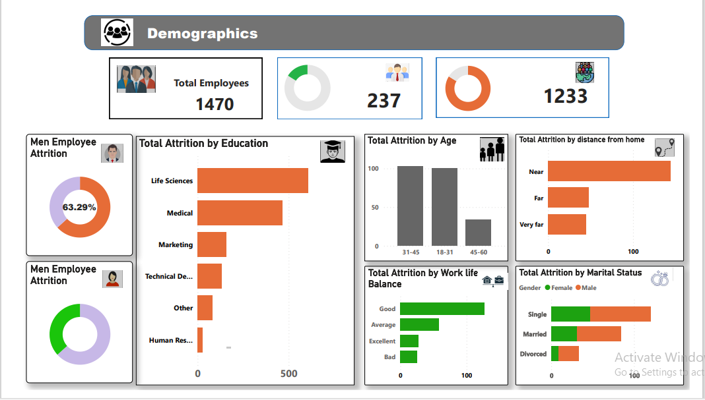
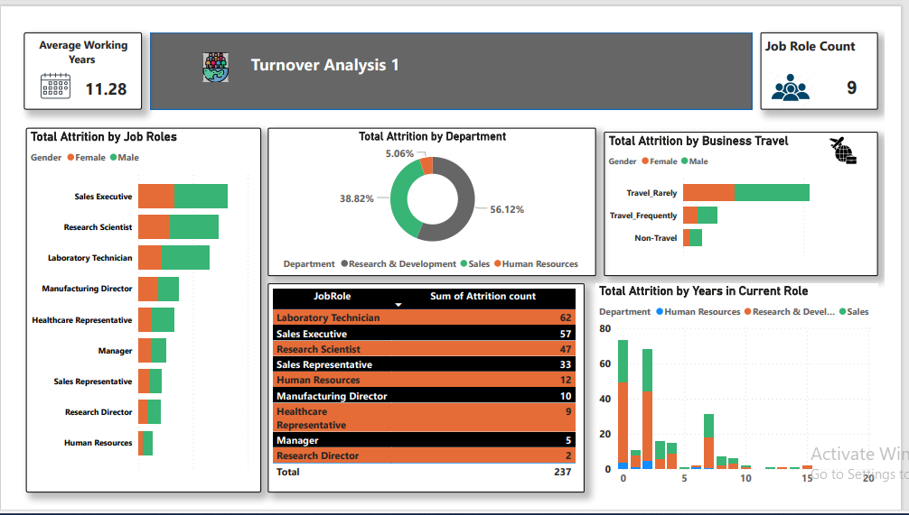
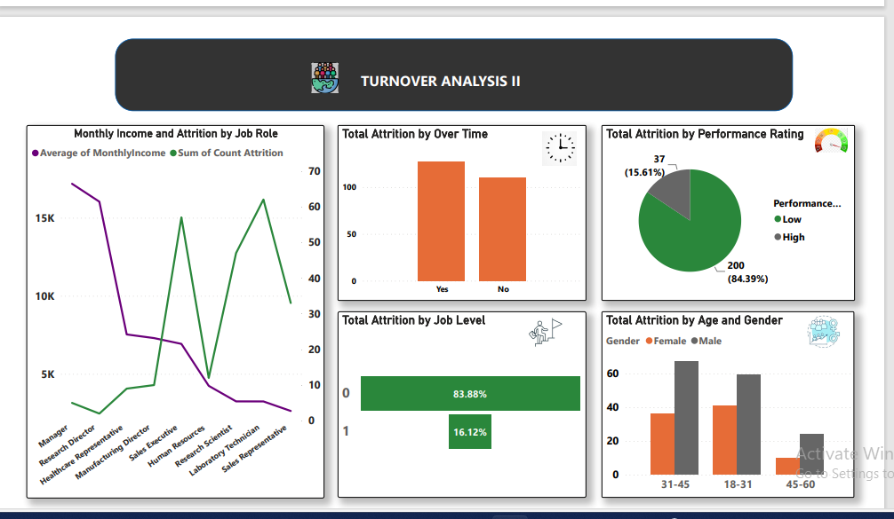
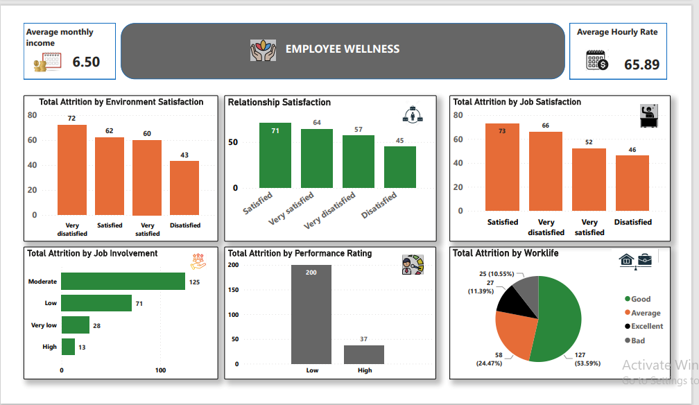

# HR-Attrition

___

## Introduction
This is a Power BI project on HR analysis of employers called **HR Attrition**. The project is to analyze, draw insights and answer crucial questions and help the HR department make adequate data driven decisions. 

_**Disclaimer**_: _All datasets and reports do not represent any company, institution or country but just a dummy dataset to demonstrate capability of Power BI_

## Problem Statement 
1.	What is the total attrition of education field and age
2.	What is the total attrition by job role 
3.	What is the monthly income and attrition by job role 
4.	The effect of environment in the employee wellness 

## Skill/concept demonstrated 
The following Power BI features were incorporated.

Bookmarking, DAX, Quick measures, Page navigation, Grouping, Filters, etc. 

## Visualization 
The report comprises of four pages 
1. Demography
2. Turnover analysis 1
3. Turnover analysis 2
4. Employee wellness

___
### 1. Demography
   

Features:
- Percentage of male and female employees
- Age range of employees
- Marital status demograpgy

___
### 2. Turnover Analysis 1
   

Features:
- Total attrition by business travel
- Total attrition by job role 
- Total attrition by years in current role

___
### 3. Turnover Analysis 2
   

Features:
- Monthly income and attrition by job role
- Performance rating
- Total attrition by overtime

___
### 4. Employee wellness
   

Features:
- Job relationship satisfaction
- Total attrition by environment satisfaction
- Total attrition by job role
- Total attrition by job satisfaction

### Conclusion 

### Recommendation 
